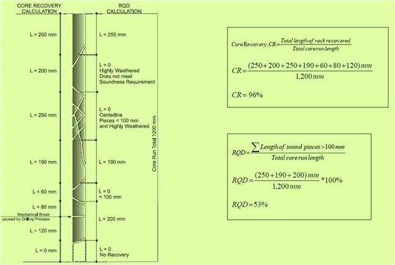
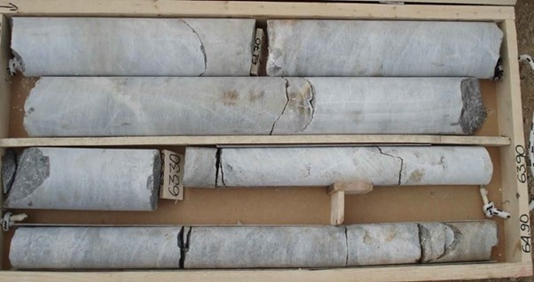

#### CORE LOGGING.
Core logging is the systematic recording and measuring of as much information as possible/required to determine the lithology (rock types), mineralogy, potential geological history, structure and alteration zones through a tiny piece of cylindrical rock drilled and removed from a potential mineral deposit. Core logging is a **highly specialized skill requiring careful observation and accurate recording.**
The Engineering core logging **provides data and parameters necessary for rock mass classification** and should be conducted so that the data can be easily applied to all industry standard classification systems.
A core sample is **a long narrow piece of rock obtained by drilling into a rock with a special tool that lifts out an intact part of the rock.** In-depth study of core samples requires a science lab full of equipment – something we don't yet have on Mars. So, we must return these samples to Earth for study.
The easiest way to characterize the amount of material recovered during rock coring is to calculate “core recovery” as **the amount (i.e. length) of recovered material divided by the total length of the core run (presented as a percentage).**

Fracture frequency is **the number of fractures occurring within a unit length. The number of natural fractures is divided by the length** and is reported as fractures per foot or fractures per meter.

### Uses of Rock Quality Designation (RQD) in Construction
RQD is used to evaluate quality of rocks such as degree and depth of weathering, zones of rock weakness and fracturing. This information is used for determining the depth of foundations, bearing capacity of rocks, settlement and sliding possibilities of foundations. RFQ helps in obtaining favorable tunneling conditions and evaluating the zones with poor quality rocks which may not support the engineering structures.
##### How important is Coring in geology?
High quality core material is **absolutely crucial to the success of a rock characterization study.** The coring program must minimize damage to the rock and maximize recovery.

**The proportion of the drilled rock column recovered as core in core drilling.** The amount withdrawn generally is expressed as a percentage of the theoretical total in general terms, as excellent, good, fair, or poor.

#### Quality of rocks and their RQD

|  Rock Quality |	RQD (%) |
| ----   | ----      | 
| Very poor (Completely weathered rock) | <25% |
| Poor (weathered rocks) |	25 to 50% |
| Fair (Moderately weathered rocks) |	51 to 75% |
| Good (Hard Rock)	 | 76 to 90% |
| Very Good (Fresh rocks)	 | 91 to 100% |